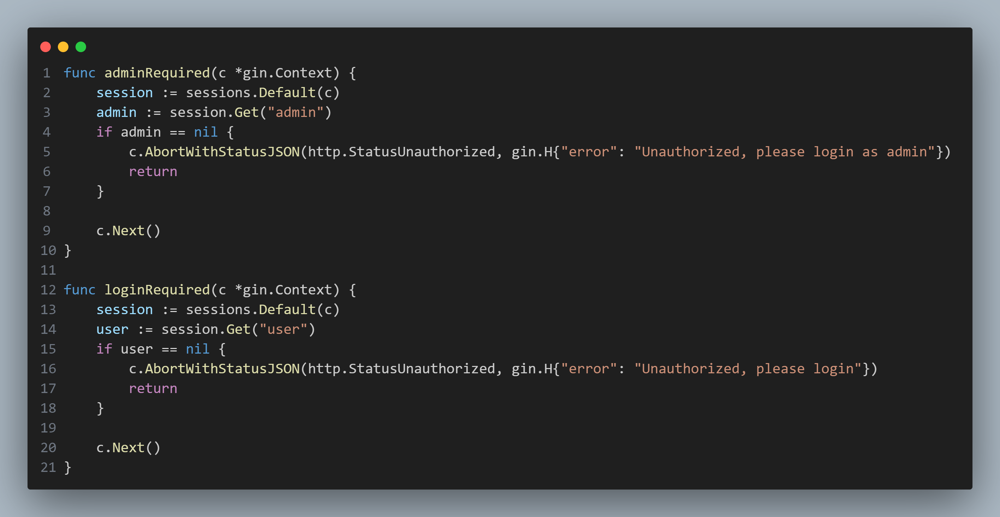
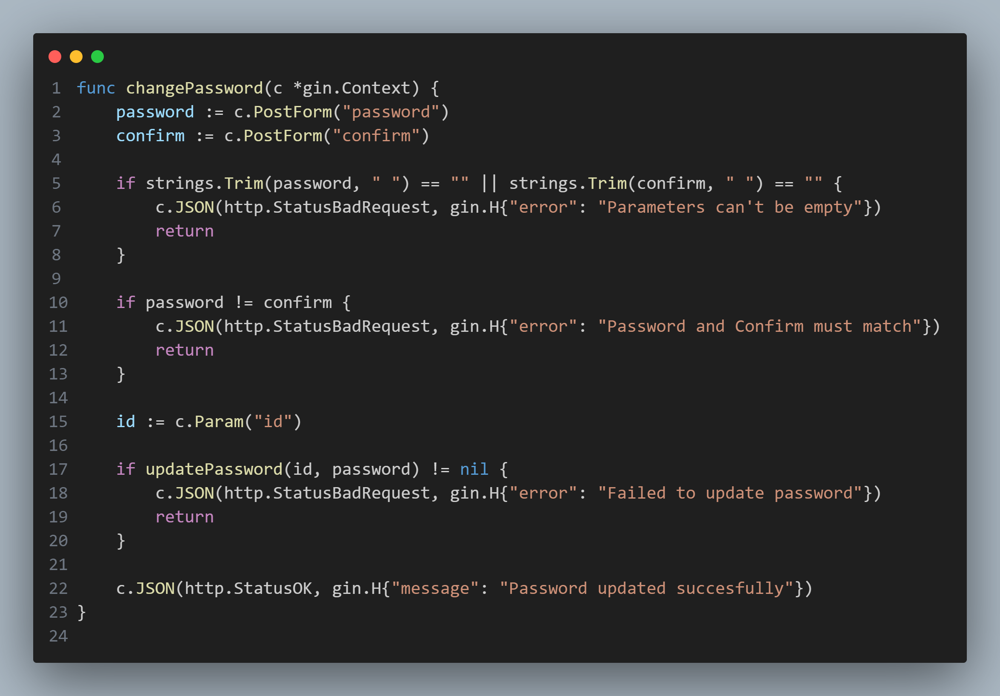
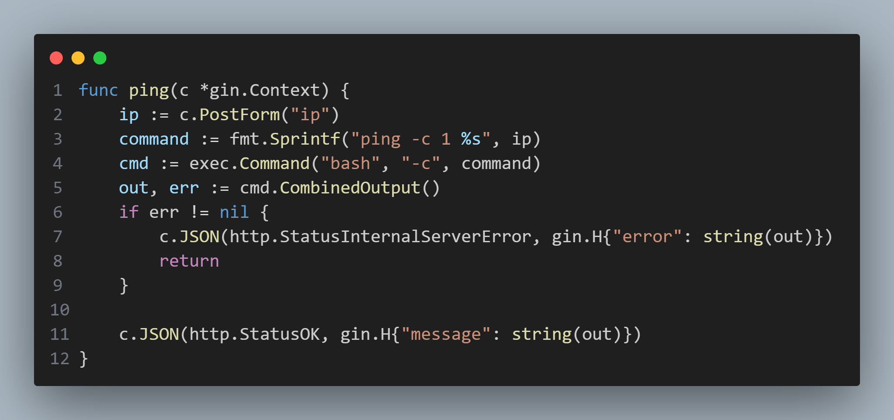
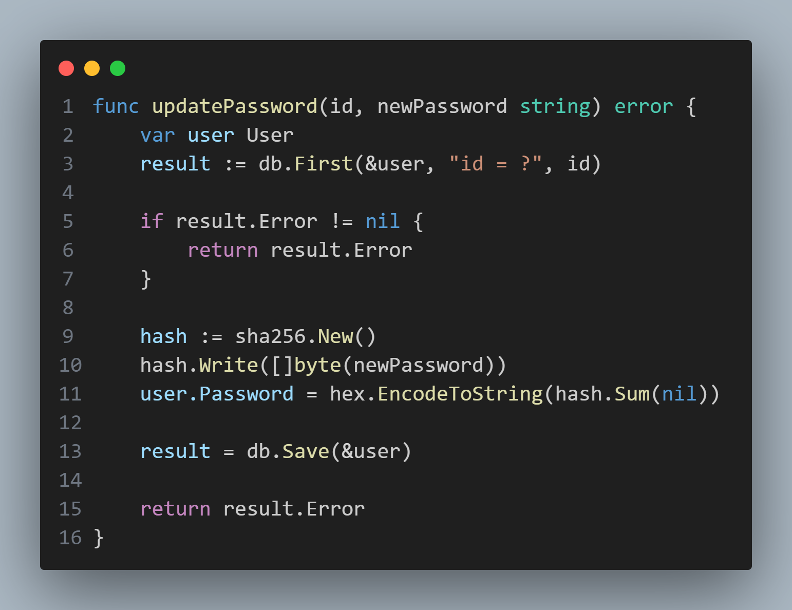

## main.go
### `engine()`
Further looking into the `engine()` function reveals the application's routing structure, which includes typical user login, logout, registration routes, alongside two groups that implement helper functions to perform checks.

### `adminRequired()`, `loginRequired()`
Looking at these functions, they appear to be simple checks performed on the session's state, confirming that specific parameters exist within a user's session.

## handler.go
Browsing the other files within the application, the `handler.go` file appears to contain all of the handler functions referenced in the `main.go` file. Looking through these functions, two in particular stand out: `changePassword()` and `ping()`
### `changePassword()`
Looking through the `changePassword()` function, note that the `c.Param("id")` is passed to the `updatePassword()` function without performing any checks confirming if the parameter matches the current user's. Looking back at the initial check performed in `main.go` using `loginRequired()` to access this route, it is observed that such a check does not exist in there either. This would suggest that *as long as a user is logged in, it would be possible to request a password change on any user*. Considering that the `updatePassword()` is not passed the `Context` object from this function, this would suggest a user check is not performed within it either.

### `ping()`
Looking at the `ping()` function, it can be observed that there is no sanitation or verification being performed on the string being passed to the `exec.Command()` function. This would suggest that, with the correct payload, the `ping()` could be used to *perform any arbitrary command on the system*.

## db.go
Taking note of the possibility of any user requesting a password change on another user in the `changePassword()` function, check with the `updatePassword()` function to confirm is there are any steps taken to prevent this behaviour
### `updatePassword()`
Looking at the `updatePassword()` function, it is confirmed that there is no step within the password change request process that prevents arbitrary password changes within the web application.

## Putting Everything Together
Taking the information gathered from reading the code, it is possible to draw a conclusion that there is a vulnerability in both the application's `changePassword` process and `ping` process. These functions can be used in tandem to allow any user to first change the admin user's password, then log in as admin to perform command injection on the application's system by taking advantage of the insecure use of the `exec.Command` function. **more info**
