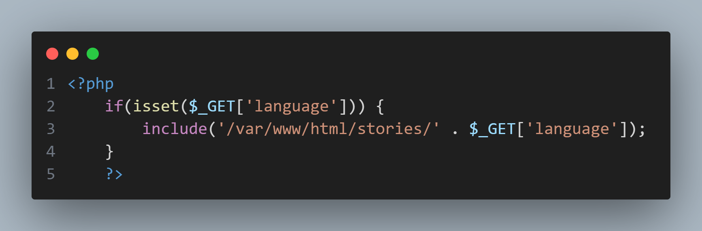
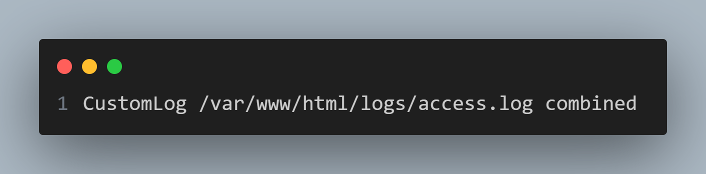
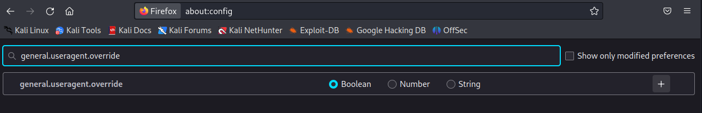
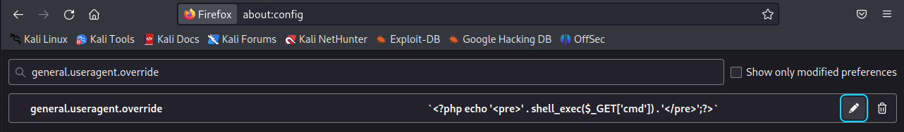
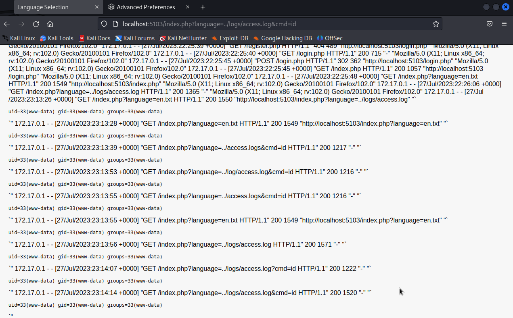

## views/index.php

Looking into the `index.php` file in the views folder of this application, a specific line of php of concern can be observed. `'/var/www/html/stories/' . $_GET['language']` implies a concatenation of as directory string alongside a user-provided parameter without any form of data validation or sanitation. Left as is, it would be possible to utilize the `language` parameter while requesting `index.php` to perform a directory traversal.
## apache-config.conf
Looking into what files could potentially be accessed for exploitation, the configuration file shows something of note.

There are access log files being created for this application. By passing the parameter `../logs/access.log`, it would be possible to view this through `index.php`
## access.log
After logging in using one of the credentials in `models/User.php`, it becomes possible to view `access.log`'s contents

As this log file would be parsed as php, this would imply that it would be possible to run arbitrary php code on the target machine if it is possible to include custom data into any part of the logs.
## User-Agent
In particular, you can observe the part of the logs that includes "Mozilla/5.0 (X11; Linux x86_64; rv:102.0) Gecko/20100101 Firefox/102.0" indicates the client's User-Agent. Considering that it is possible to freely later one's User-Agent information, even within a browser, it should be possible to utilize this fact to change the client's User-Agent information into arbitrary php code which will subsequently be run whenever the `access.log` file is requested.
## Firefox Example
### Changing User-Agent

Navigate to `about:config` in the address bar and enter `general.useragent.override` into the provided search bar.

Select String and the `+` button then write the desired php code as the parameter's value
### Running arbitrary commands
Returning to the application tab, re-request the access logs, instead this time, include any additional parameters you may desire to include to further exploit the system through this vulnerability.

