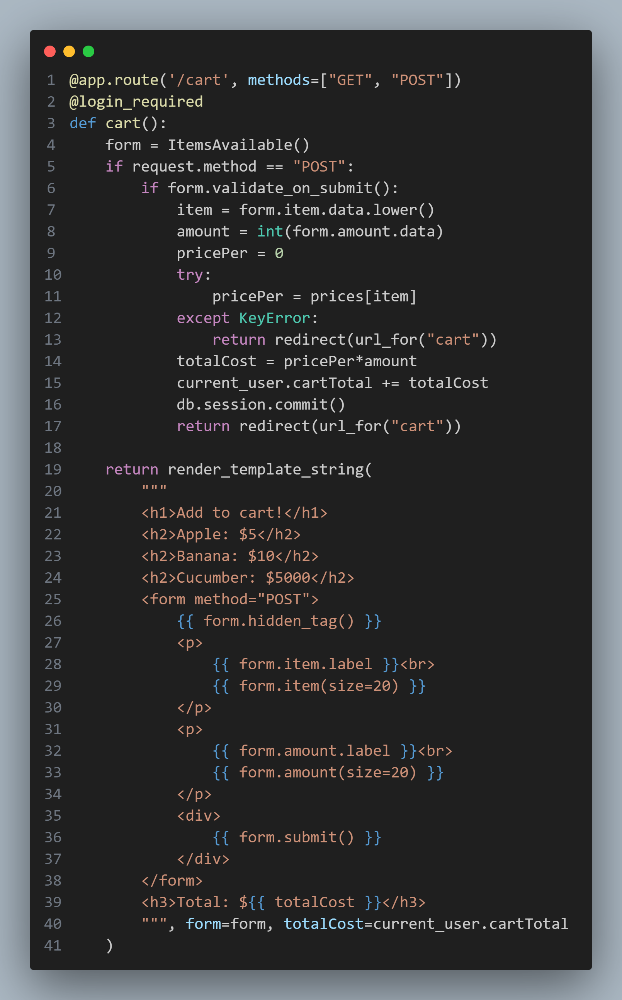

# Solution

## app.py
Looking through the application, functions such as `gen_coupon()`, `cart()`, and `checkout()` indicates that the application may serve a shopping function, tracking user balance and cart totals. Two functions in particular appear to have potential vulnerabilities: `index()` and `cart()`
### Vulnerability 1 - `index()`

Observing how the `index()` function handles POST requests, it can be observed that the coupon code query checks for the existence of the code and that it has not already been redeemed. However the logic does not confirm user redeeming the code is associated with the user that is directly related to the code in the database. Considering that a new coupon is generated and displayed upon registering a user, as seen in the start of the `register()` function and the later half of the `index()` function, it becomes possible to exploit this lack of a check by generating a large number of users, retrieving their coupon codes, and redeeming them on a single user to perform large purchases.`### Vulnerability 2 -`cart()` Both In the template rendered in the`cart()`function, and in the POST request handling portion of the function, it can be seen that there are no checks being performed on the`amount\` parameter. As such, it would be possible to enter a negative number, resulting in a negative cart total balance. By subsequently performing a checkout on the requested cart total, it would be possible to increase the user account's balance.
### Vulnerability 2 - `cart()`

Both In the template rendered in the `cart()` function, and in the POST request handling portion of the function, it can be seen that there are no checks being performed on the `amount` parameter. As such, it would be possible to enter a negative number, resulting in a negative cart total balance. By subsequently performing a checkout on the requested cart total, it would be possible to increase the user account's balance.