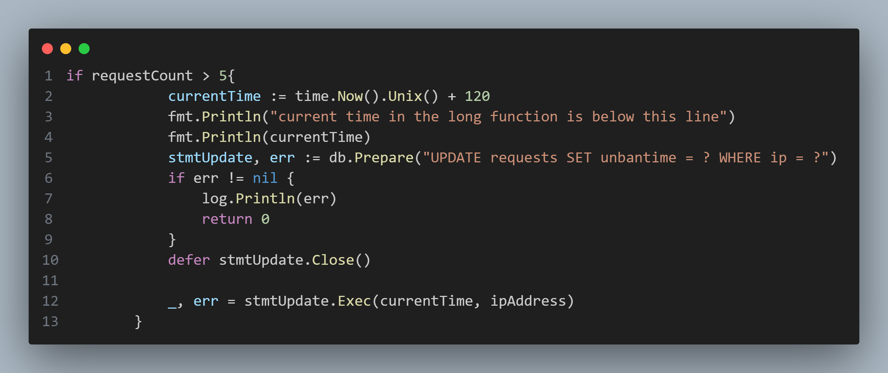
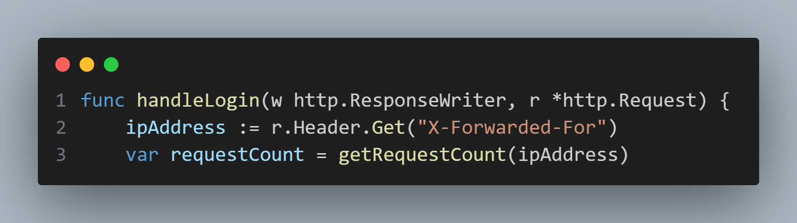

## main.go

Reading through the main script file, it appears that this application's main functionality is to provide a login interface that has implemented a method to track login attempts, and prevents any one IP Address from attempting to login more than 6 times in quick succession, timing them out for a specified period of time.

However, looking into the `handleLogin()` function shows that the client's IP Address is retrieved through the requests' `X-Forwarded-For` header value. As this value can be freely manipulated by the client, it is possible to craft a script to brute force credentials on this application while randomizing the `X-Forwarded-For` header value between each request to circumvent the application's brute force prevention measure.

