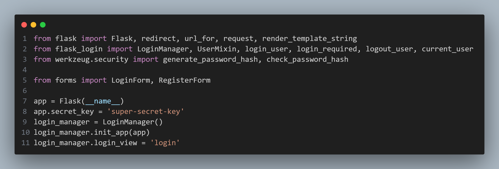

# Solution

## app.py
On opening the file, the import list and first 5 lines of code shows that the application is built to serve as a Flask web application.

### `index()`
Reading down the file, `index()` appears to be the first function to contain something of note:

It appears that the current user's username is directly concatenated to the page's response body, which is then run through Flask's `render_template_string()` function. Looking into documentation on its templates, it is detailed that Flask utilizes Jinja as its templating engine, which not only allows access to various data stored within the application, but can allow for writing extensible code. As such, if there is no data sanitation performed on usernames, it would be possible to utilize this fact to employ further Server-Side Template Injection (SSTI) techniques.
Further lines will be read for signs of data sanitation or validation.
### `register()`

The next area to note would subsequently be the `register()` function. As this function would handle validating usernames, if there is nothing preventing the use of Jinja templating information, it would further support the idea that this application is vulnerable to SSTI. As seen on line 9 of the code snippet above, the new user data is appended without performing any visible checks.
As no other parts of `app.py` appears to handle the stored username information, the next step would be to observe the `forms.py` file to verify if there are any preventative steps taken there instead.
## forms.py

Looking at `forms.py` it can be observed that the only validation performed checks that there exists data, and that there is a minimum and maximum length requirement for usernames. Although this would restrict possible actions, it is likely to not prevent SSTI.
## Putting Everything Together
Knowing that the user landing (index) page is vulnerable to SSTI, it would be possible to execute commands by crafting usernames that align with Jinja syntax. An attacker would first register a user with the desired payload as the username, and the subsequent redirection to the index page would be sufficient to perform an exploit. This could not only lead to cross-site scripting, depending on where else the user's username is displayed, but could open up to allowing the attacker to escape the Jinja engine's sandbox and perform remote code execution on the server's machine.
