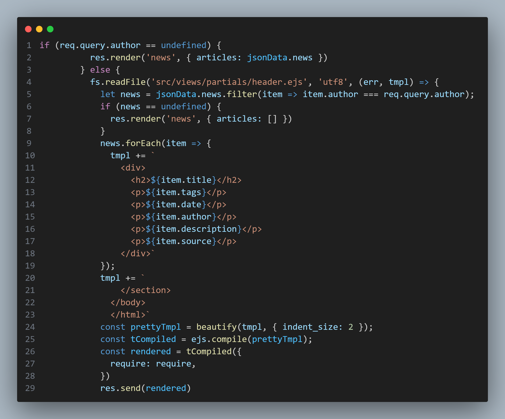
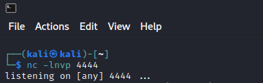
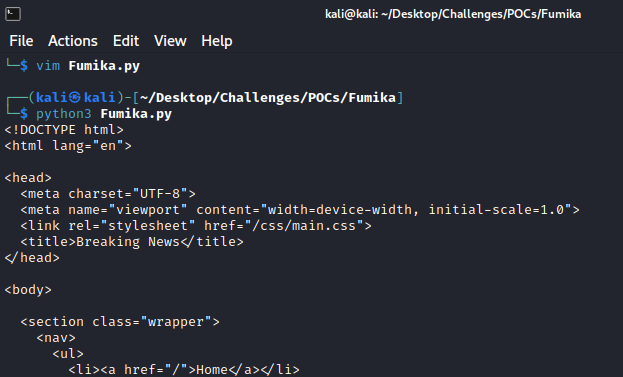
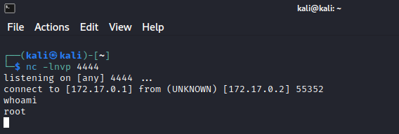

## routes/news.js

Observing the `news.js` file, it can be seen that, in the case of an `author` parameter being specified in the request, the template itself is modified, with items being appended to it. Due to this implementation of EJS, it is possible to inject arbitrary template syntax into the system by making a post containing exploit code and subsequently loading `news.js` with the author's username involved.
# POC Execution
## Open netcat to listen for reverse shell

## Triggering reverse shell via Template Injection
Run `poc.py` - Note: change the ip address specified in Fumika.py to match the docker0 interface on your machine

Interact with compromised shell through netcat

