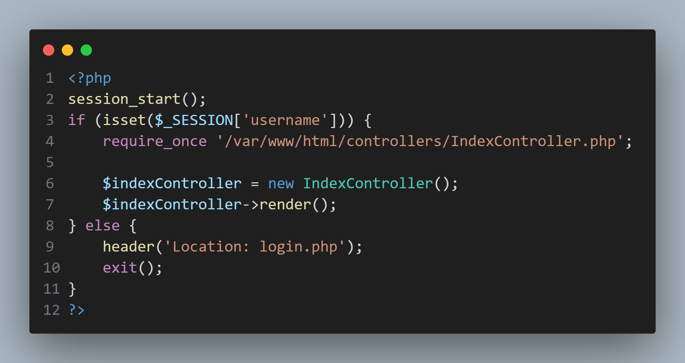
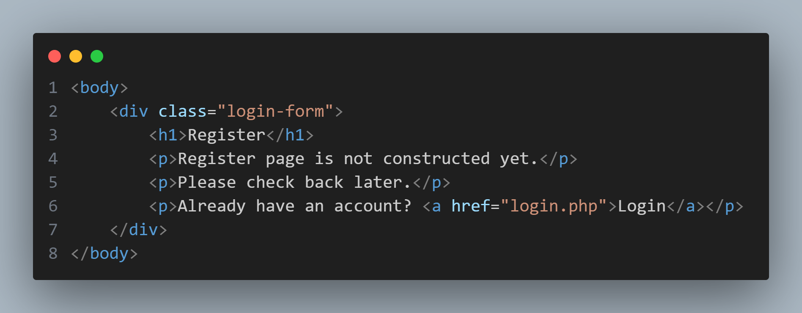
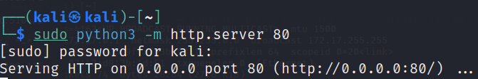
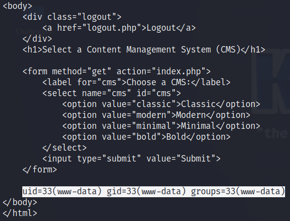

# Solution

## index.php

Looking that the file, it appears that it utilizes the `IndexController.php` to render the page, while otherwise redirecting users to a login page if a username is not set. The other php files at the base of the application folder appears to operate in a similar manner. As such, they will not be covered in depth.
## IndexController.php

It appears that the sole function of the `IndexController.php` file is to use the `render()` function to call the `index.php` file that is contained in the `views` folder (thus labeled, `views/index.php`).
## views/index.php
Although the majority of the `views/index.php` file appears to function as a static form, the snippet of php code near the end of the file contains elements of note.

As seen in lines 3-6 of the code snippet above, it appears that if the value passed to the `cms` parameter is formatted to be an http(s) URL, it would be possible to render any page or command through this parameter through the use of appropriate servers.
As there is a lack of sanitation on what URLs can be referenced, and how it will be rendered, it would be possible to run arbitrary php code (and thus shell code) on the server's system. However, as `view/index.php` is inaccessible without logging in, the next step would be to figure a method of entry. Unfortunately, there does not appear to be any username/password pairs stored in the code, nor is it possible to register a new account, as the `register.php` page has been replaced with an out of service message.

## LoginController.php
In order to figure out a method of logging in, following the code in `login.php` reveals the login process within `LoginController.php`

## User.php
Following the `getUser()` function called by the `User()` object leads to the `User.php` file.

This function appears to utilize an unsafe method of concatenating the query string with user input to build an SQL query. With this in mind, it should be possible to perform an SQL Injection on the login page that causes the query to always return true, and thus allow anyone to authenticate into the server. By combining this with the exploitable `view/index.php` page, an exploit chain that can lead to a potential remote shell is revealed.
# POC Execution
## Create a php page to serve as a payload, and a server to provide the page to the vulnerable server

Above: Possible payload to allow arbitrary shell command execution on the target machine
Below: Providing a server for the payload to be served through

## Run poc.py

Above: Running server and POC script.
Below: Resulting message body from server

