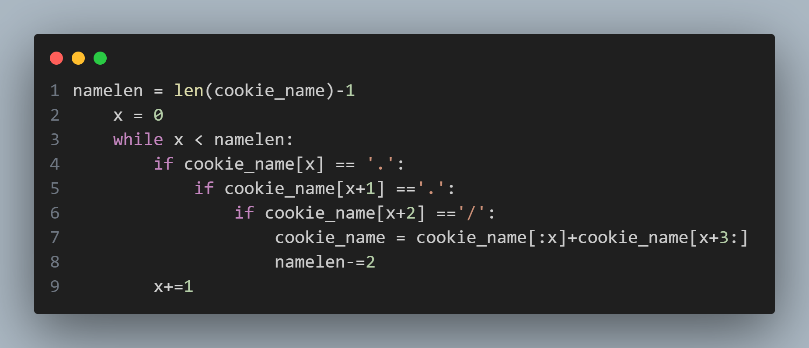

## app.py

Reading the source code, the application appears to function to serve a set of predefined image files based on what the client requests. This is done by attempting to fetch the resource by specifying its path relative to the machine's `cookie` folder. In addition, to prevent directory traversal, the request's input appears to attempt to remove instances of `../` in the string.

However, this implementation is faulty and still allows for directory traversal, namely through the use of `....//` and similar strings, which after running through this loop, will be interpreted as `../`. By making use of this behaviour, it becomes possible to access any files that the application has permission to read.
