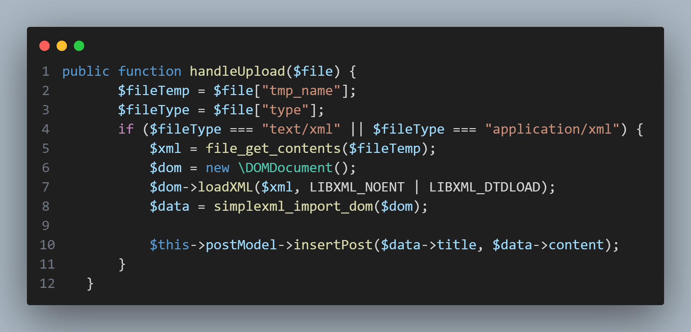
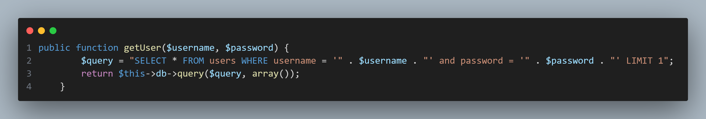

## controllers/UploadController.php

Looking at the `UploadController.php` file, it can be observed that the xml file being passed from the client is directly loaded via the `loadXML()` function. Searching into the parameters included in the function, it is revealed that the `LIBXML_NOENT` flag allows for entity substitution. The php documentation website additionally warns that enabling this flag may facilitate XXE attacks. As such, anyone that is allowed to freely upload XML files could execute code on the target machine by taking advantage of this fact.
## models/User.php
However, there does not appear to be any plaintext user/password pair to utilize, nor a method to register a user to log into this application.
Following the application's logic for handling user login, a few lines of note can be found in `models/User.php`

Here, it can be seen that the SQL query is constructed unsafely, using string concatenation to build the statement out of user input. As such, it is possible to bypass user authentication by including the string `' OR 1 == 1 --` in either the username or password field.
As such, by bypassing authentication, and then subsequently uploading an XML file that can exploit the XXE vulnerability, it becomes possible to compromise the target system.
For an example of a potential exploit, view the POC.py associated with this challenge.
