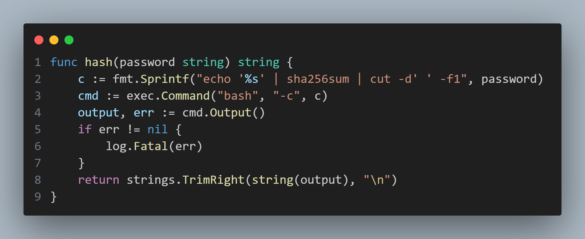
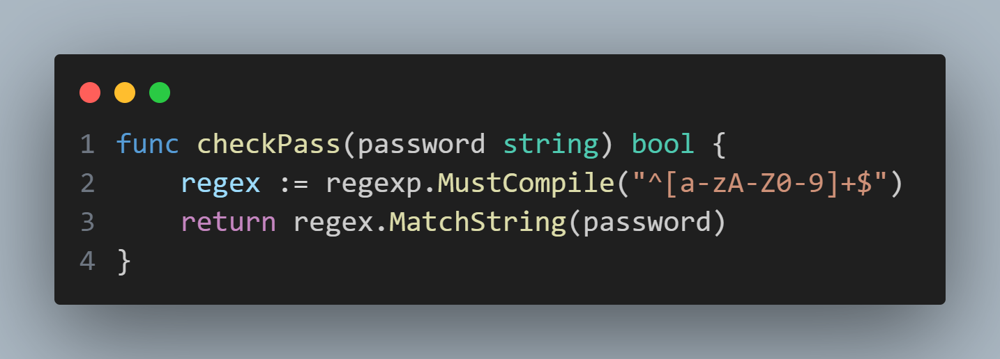
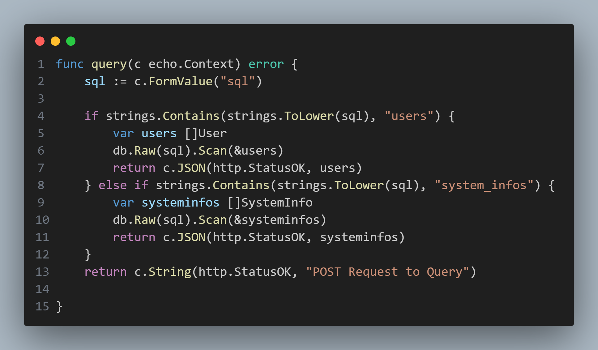

## helper.go

Looking through the files, a potentially dangerous function is seen in `helper.go`

The `hash()` function utilizes the `exec.Command()` function, with "bash" and "-c" as its parameters. As such, if the input to this function is not handled carefully, it would be possible to run arbitrary commands on the target machine.
Observing where this function is used, it appears that as long as a user's password is registered to be a desired payload, this function would run that command when the user attempts to log in. However, it does appear to be possible to simply register a user with such a password as the registration function includes a `checkPass()` function that would prevent any potential special characters to be used.

## handler.go

Further investigation reveals that the `query()` function in this application is vulnerable to SQL Injection. as `db.Raw()` accepts any user input without any form of sanitation, it would be possible to manually insert user/password data into the application database without having to utilize the application's limited `register()` function.
As such, by first injecting your desired payload as a user's password through the applications `query()` function, it would subsequently be possible to run the payload on the target machine by attempting to log in as this newly created user.
