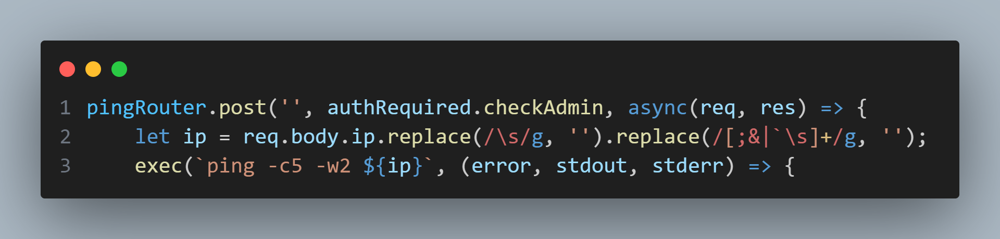
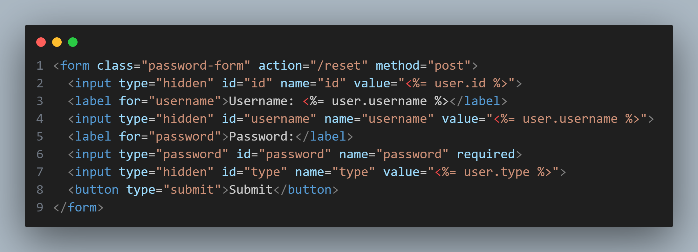
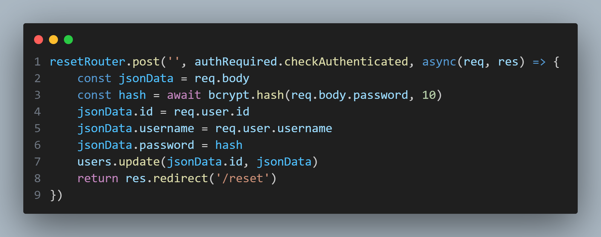
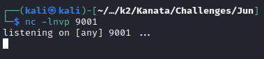
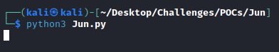

## routes/ping.js

The first function of note in this application is found in the `pingRouter.post()` router in the `ping.js` file. Although regular expressions preceding the `exec()` function limits what can be done, searching up key terms such as IFS and bypass returns various ways to run commands on the target system largely unhindered. However, seeing as the ping function is limited only to admin users, further investigation would be required to discover methods to authenticate as one.
## routes/reset.js and views/reset.ejs
While finding the password for the existing 'admin' user is a matter of guessing common default passwords such as 'admin' and 'password', it appears that this account does not have access to the ping functionality of this application, as the 'admin' user's type is still labeled as 'user'. Looking into the data submitted through the `reset.ejs` form reveals a solution

The form includes a hidden value labeled as "type" that is submitted alongside all other information. Looking into how `resetRouter.post()` in `reset.js` handles this value reveals that the type value is updated as-is for the requesting user.

As such, it would be possible for any user to use this form to change their user type and thus gain access to the ping function.
By leveraging this feature, it would be possible to effectively gain access to the target machine via the ping function as any authenticated user.
One such example of this is in the provided POC.py script, in which netcat is installed onto the target machine, and is subsequently used to provide a reverse shell to a listener set u on the attackers machine.
# POC Execution
## Set up netcat
Utilizing any available port, set up netcat with the `-lvnp` options

## Run poc.py on the target machine
Make sure to update the `ip` value to the attacking machine's ip, and the `listen_port` value to the port with which netcat was setup

