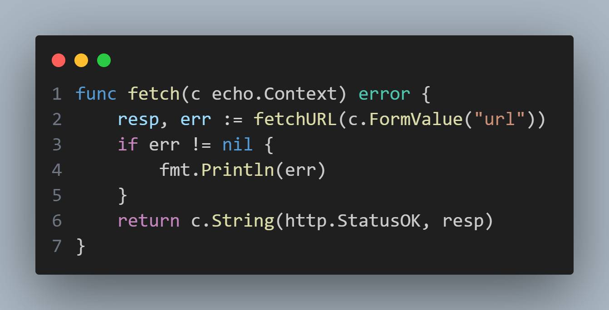
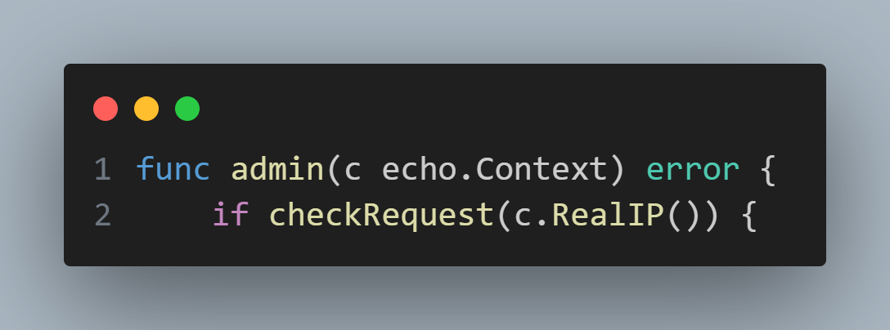

## handlers.go

Within the `fetch()` function called through the `/fetch` route, the application retrieves user data and attempts to fetch data from the string (assumed to be a URL by the application). Following the `fetchURL()` function into the `helper.go` file reveals that the user data is neither sanitized nor validated, and the application trusts the user input to perform a GET request to the supplied URL.
However, as this GET request is performed by the target machine, it would then mean that this application allows users to force the machine to perform any arbitrary GET request, and subsequently output the response. One possible exploit using this function would be to use it to run functions or files with restrictions that would prevent regular users from running or accessing them.

`admin()` is one such function that fits the bill. After first checking if the requester matches the intended admin's IP address (127.0.0.1), it subsequently returns the target machine's Operating System details. By requesting this admin page through the `fetch()` function would effectively allow any user tor access this machine's information details.
