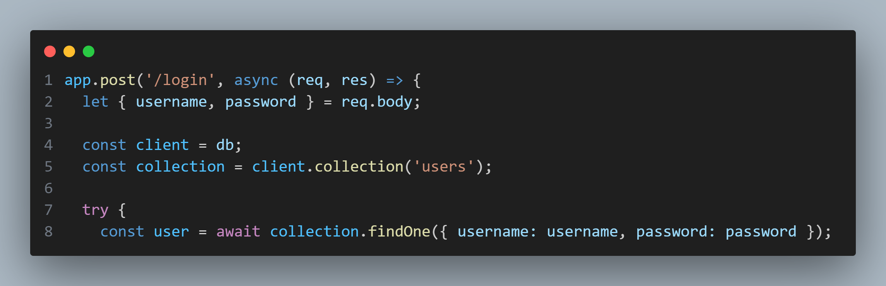

## app.js

Perusing the `app.js` file reveals a potentially dangerous implementation of MongoDB' `findOne()` function.

In this implementation, the application directly receives user input and feeds the values into the query without performing data sanitization. Looking up how MongoDB's query operators work reveals that it is thus possible to replace the password field value with a query operator.
By using a conditional that always evaluates to true, it is then possible to log in to this application with any known, registered, username, such as 'admin'.
