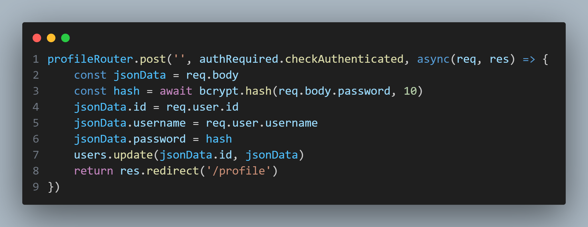
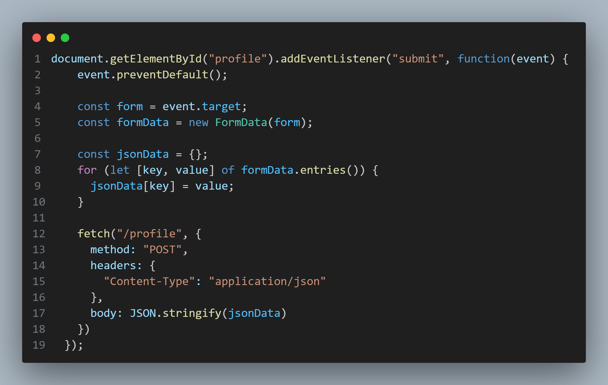
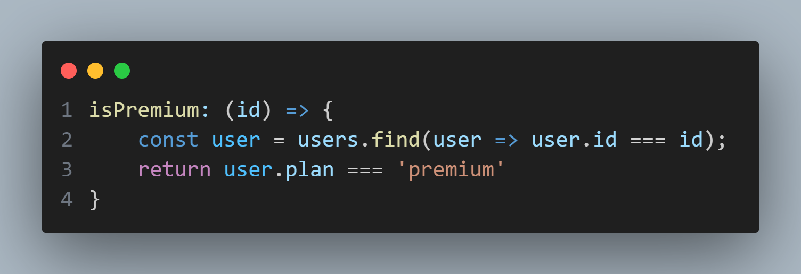

## profile.js

`profile.js` provides a handler for POST requests to the `/profile` route. One point of concern of how this function handles the updating of the account's profile update is that it passes the entire `jsonData` object to the `users.upadte()` function. Depending on how the object was handled, and where the data is originating from, it is possible that raw user data could be used to alter user parameters that were originally not intended to be altered through this function.
## main.js

Observing the `main.js` file reveals a little more about what type of data is being passed to the `profileRouter`. On submission of the form in `/profile`, the form's data is combined into a single JSON object to be passed to `profileRouter`. As such, it appears that there's no form of data validation or sanitation that would prevent users from changing various aspects of their account by sending additional data in the JSON object.
## register.js
Looking through the different user attributes and where they are used, the `plan` field is found in the `isPremium()` function.

Reading through the application reveals that this attribute is utilized to determine if there is a limit to the number of news articles a user can view.
As such, it would be possible to edit a registered user's `plan` value to "premium" through `/profile` to unlock a level of access that was previously restricted.
