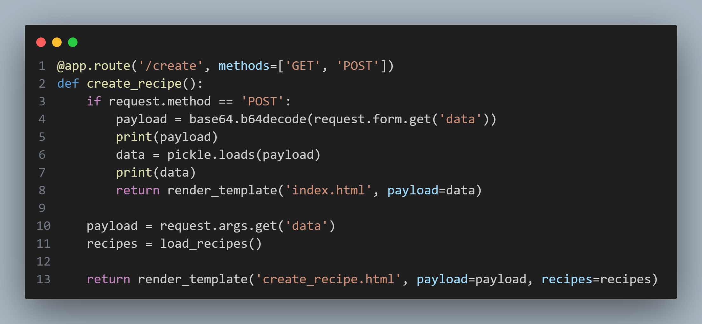
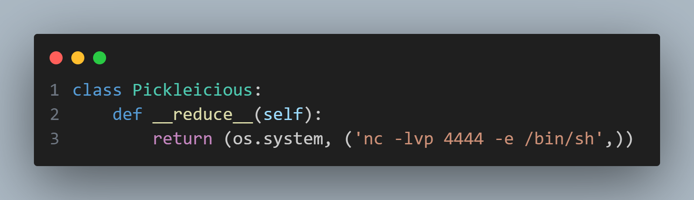

## app.py

This application implements object deserialization using user-provided data.

Taking into consideration the possibility that it may be possible to produce undesirable behaviour, we would look through the application to see what object types can be passed into this function.

At the top of the application script, the class, `Pickleicious` can be be seen, providing a single `__reduce__` function. Looking into the relevance of this function for deserializing with the Pickle library shows that it's a function that's required to be overidden by classes that are to be used with the library.
Understanding how the return values behave reveals that, if a serialized object of this class were to be passed to the application's `/create` route, a netcat reverse shell would run on the host machine, providing external users access.
# POC Execution
1. Change port and ip values in poc.py to match the target machine's values, run poc.py
2. On success, connect to the target machine's newly opened service with `nc target_ip target_port`
* Note: if connection fails, attempt to connect to `target_ip + 1` (if target IP is 172.17.0.1, nc to 172.17.0.2)
