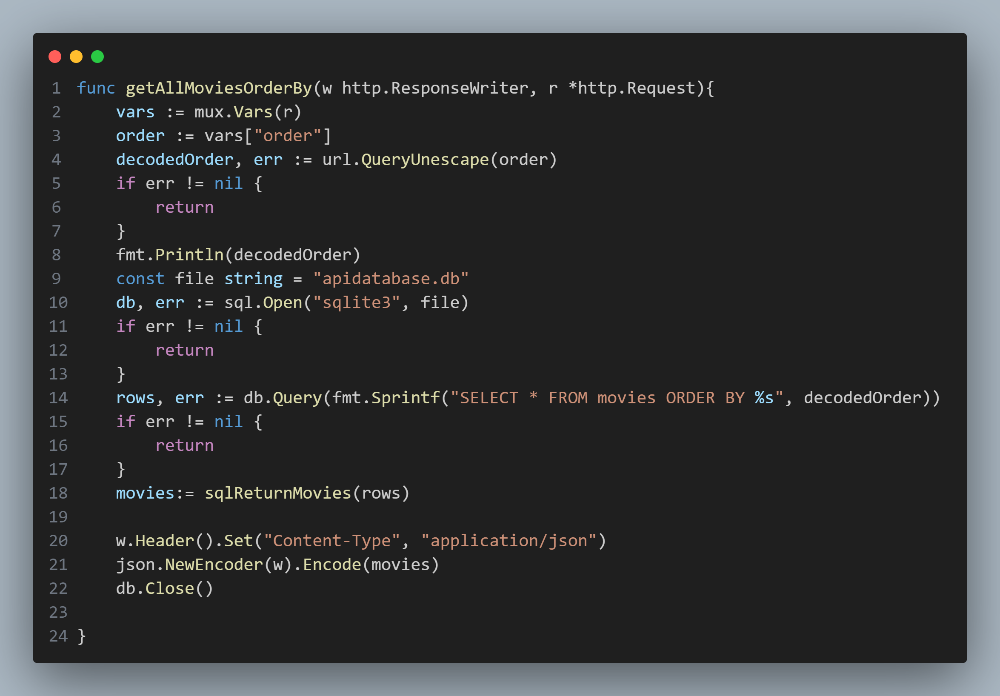

## main.go

The `main.go` file contains numerous routes that query the application's database. The `getAllMovies()` function, however, stands out through its use of `Sprintf()` to insert user input into the SQL statement instead of utilizing the `?` special character. Looking up "ORDER BY' SQL injection vulnerabilities reveals that the application's database can be freely queried through a `WHEN` statement, returning a true/false response to queries, depending on the order of the returned set of values.
