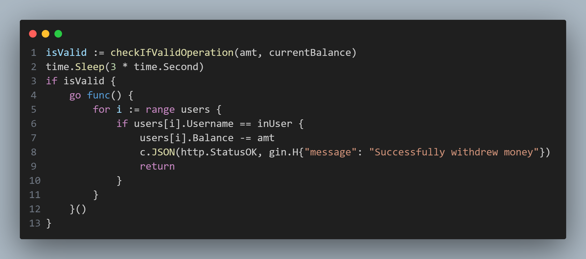

## handler.go

In `handler.go`'s `withdraw` function, there exists a snippet of code where a sleep operation splits up the `checkIfValidOperation()` function and the actual withdrawal operation. As such, if a user manages to request multiple withdraw requests within this window, it would be possible to take out more money than the account actually holds, as the check operations will occur before the first valid withdrawal occurs.
