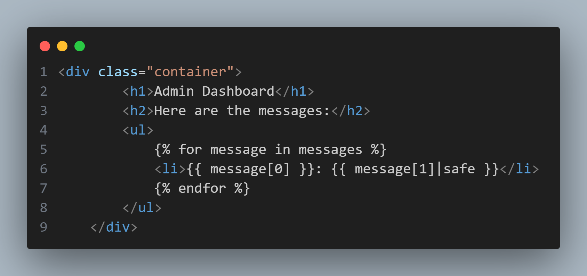
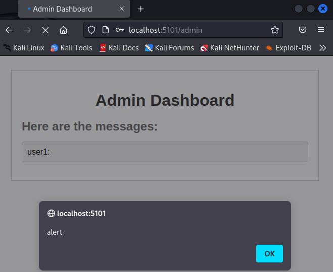

## templates/admin.html

One of the first things of note in this application appears in the `admin.html`, where the keyword `|safe` appears in the template. Looking into the meaning of this tag in Jinja2, the templating language Flask utilizes, reveals that this marks a string's special characters to not be escaped automatically, as the string's contents have been deemed safe.

However, reading the `admin()` function in `app.py` that passes the values to be parsed as `messagse` reveals that every user's messages are simply aggregated into a list for the admin user to view.
Due to this behaviour, it would be possible for any user to perform as Stored Cross-Site Scripting attack against the admin user.
\## Example
It is possible to see this behaviour in play by using the credentials provided in the application to first authenticate as any user, submit a message containing observable javascript (such as ``), and then logging in as the admin user to view this message through `/admin`

