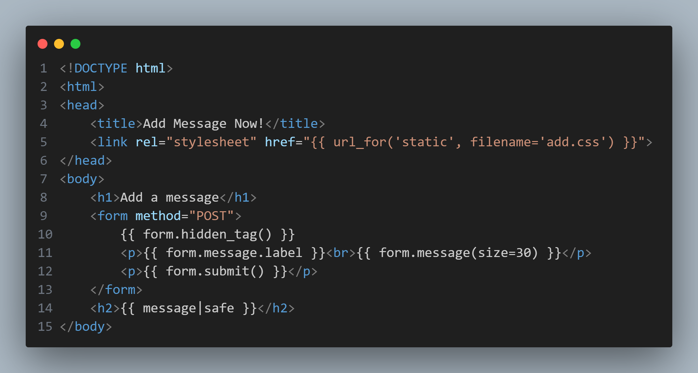
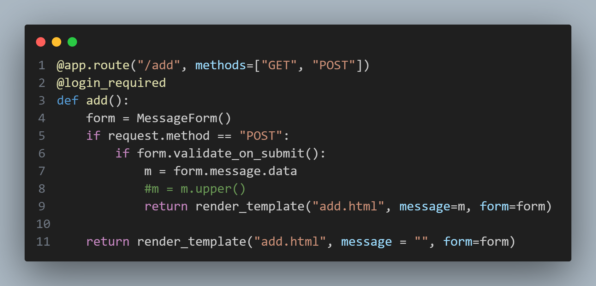

## add.html

The `add.html` file contains the utilization of the `|safe` keyword in its template, which prevents special characters from being escaped/encoded when the html page is rendered. As such, if there is a method to pass javascript content into this message block, it would be possible to perform a Cross-Site Scripting attack.
## app.py

From looking through the application script, the `message` parameter that is passed onto the `add.html` template is user-submitted form data without any modifications. Although the implementation of CSRF tokens in this application prevents common methods of performing Reflected Cross-Site Scripting against a victim machine through this application, it is still possible to observe the behaviour of this type of Cross-Site Scripting through regular form submissions containing javascript.
