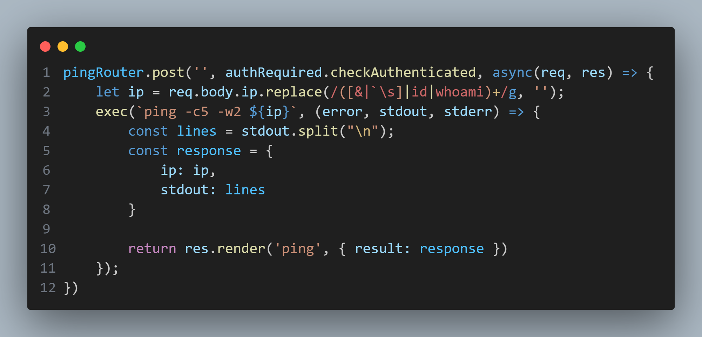

## ping.js

The `ping.js` file contains a method to handle POST requests to the `/ping` route. Reading the handling function, it appears to attempt to sanitize user input prior to running it with the `ping` command through `exec()`. As such, if there is a method to bypass the sanitation, it would be possible to run arbitrary shell commands on the target machine.
Breaking down the regular expression, it appears to both remove specific keywords, alongside a few symbols. As the semicolon is not removed, it should be possible to chain commands. To then bypass the regular expression's removal of whitespace, whitespaces within the payload can be replaced with `${IFS}`. Lastly, blacklisted keywords can be circumvented through command substitution, stitching back together individual characters of the command through the use of `$(echo)`. For example, the `id` command can be stitched together by crafting the string, `$(echo${IFS}i)$(echo${IFS}d)`.
Note: There are multiple methods to bypass this type of blacklist.
## users.js
`users.js` reveals the single registered user, 'admin'. Playing around with common password values reveals that the user's password is also 'admin', allowing access into the application and thus allowing arbitrary users to run the vulnerable `ping` route.
