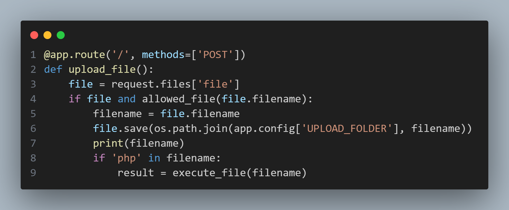
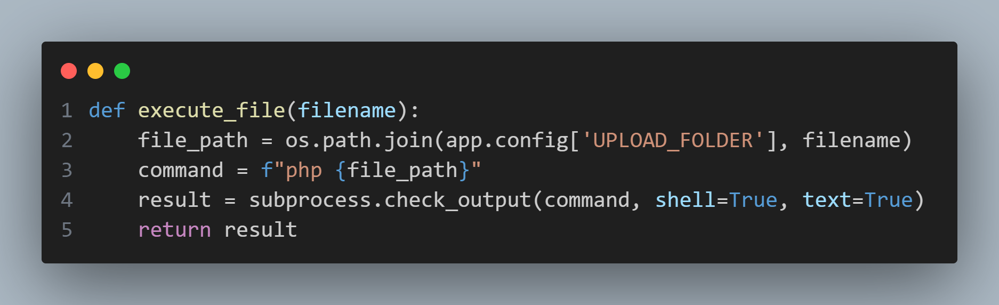

## app.py

Although the application requests for the user to upload an image file for the application display back, there appears to be special handling for files with the `.php` extension

Looking into how this `execute_file()`function handles php files, there are two vulnerabilities:
* Since the command trusts and runs any user-provided php files, it would be possible to run shell commands through php's `system()` function
* Due to the unsafe method in which the command itself is built, it is possible to inject additional commands into `subprocess.check_output()` by crafting a filename that would first complete the php command, run additional commands as desired, then the file with a command along the lines of `|| .php` to allow the filename to be considered a php file and thus run through the `execute_file()` function.
