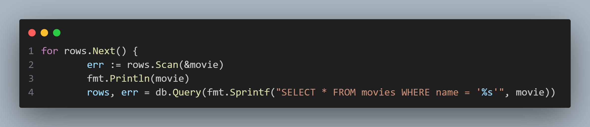
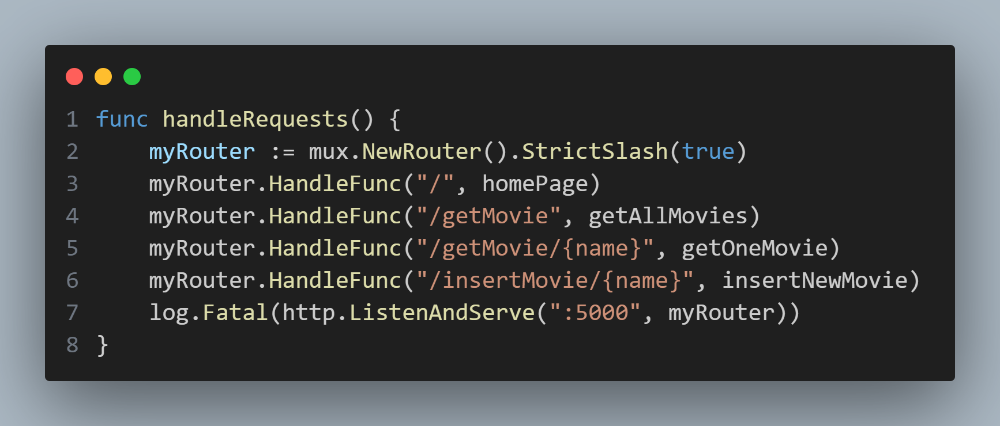

## main.go

An insecure implementation of SQL querying is observed within the application's `getOneMovie()` function. Considering that only movie titles stored in the database can be utilized in this query, the next step of inquiry could be to search for methods to supply user data in to the movies database.

Looking at the application's possible routes, `/insertMovie/{name}` provides exactly that, and reading further into the `insertNewMovie()` shows that the function does not provide any data validation or sanitation that would prevent SQL Injection exploits from being stored in the database.
Consequently, by first storing the desired payload within the application database, it would be possible to cause an SQL Injection in the `getOneMovie()` function by simply searching for the payload as a movie title.
