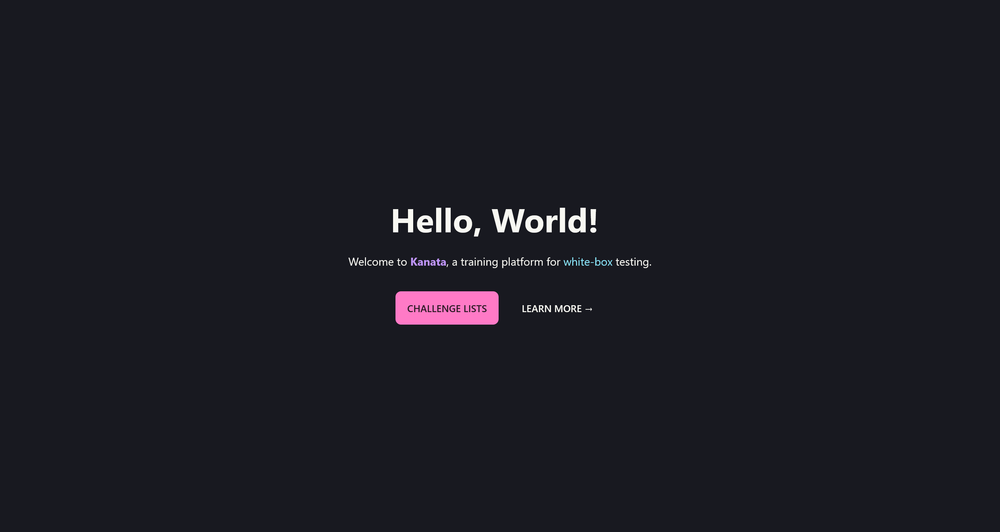

# Kanata

Kanata is a suite of vulnerable by design web applications that provides a safe and legal environment for students to learn and practice white-box testing approaches. Kanata equips students with the skills they need to identify vulnerabilities in web applications and build effective security mitigations.

Students are presented with a range of web applications that simulate real-world scenarios, allowing them to apply their knowledge in a practical setting. By working through these challenges, students gain hands-on experience with common security threats and learn how to develop effective mitigation strategies.

## 🧐 Features

1. Contains a variety of web applications with intentionally designed vulnerabilities.
2. Allows students to explore different types of vulnerabilities and learn how to exploit and mitigate them.
3. Each web application provides various endpoints to interact with.
4. Includes easy-to-start docker containers that deploys the web applications.
5. Contains detailed solutions that are delivered via text and video.

## 🛠️ Getting Started
To set up Kanata on your machine, you can follow these steps for a smooth installation process:

### Prerequisites
- Docker
- Python3
- NodeJS & npm

### Installation
1. Clone the Kanata repository
2. Start the Kanata dashboard
3. Have fun!
